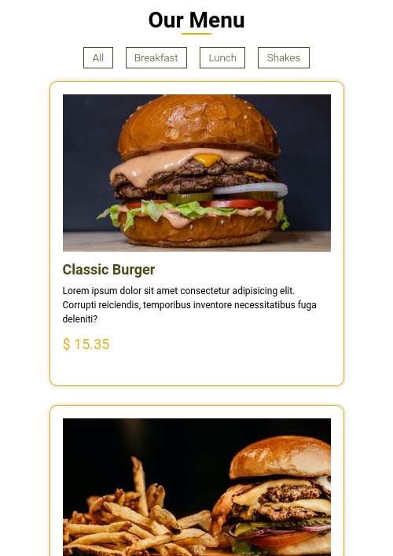
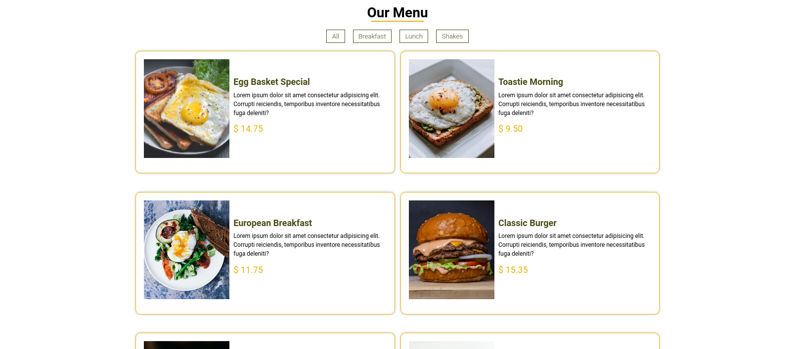
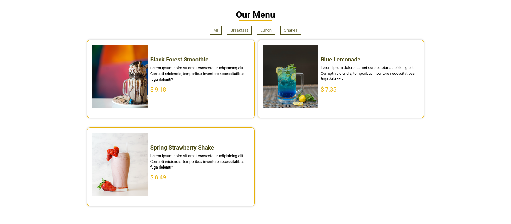

# Cafeteria Menu App

Responsive menu app for a cafeteria that allows you to filter between different kinds of meal.

## Screenshots

## Installation

1. Clone the repository `git clone https://github.com/AlexdelCarmen/cafeteria-menu`
2. Open the `index.html` in your browser.

## Features

- Responsive app changes display depending on viewport width.
- Filter buttons on top, can be clicked to change the menu items being displayed.

## Technologies

Made with:

- HTML
- CSS
- JavaScript

## License

This code is licensed under the Unlicense.  See the [LICENSE](./LICENSE) file for details.

## Credits

- Inspired by the projects from John Smilga's [video](https://youtu.be/3PHXvlpOkf4) for freeCodeCamp.
- Coded by [Alejandro Borges](https://github.com/AlexdelCarmen)